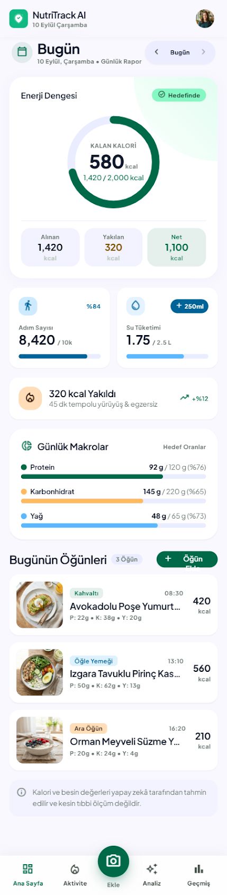
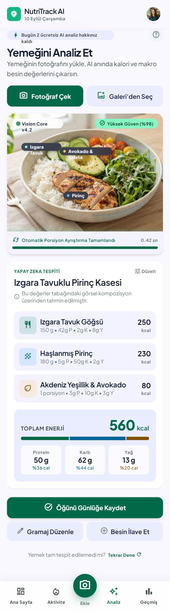
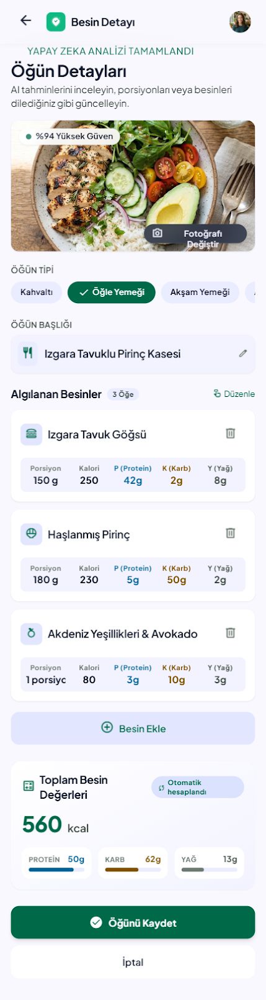
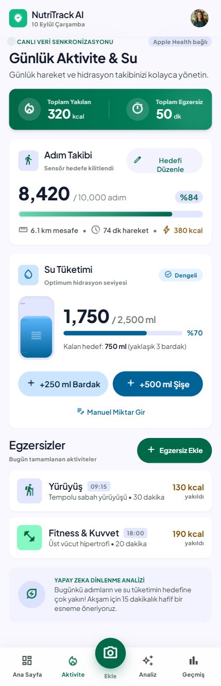
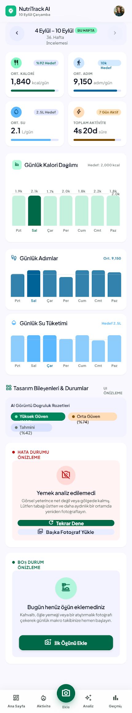
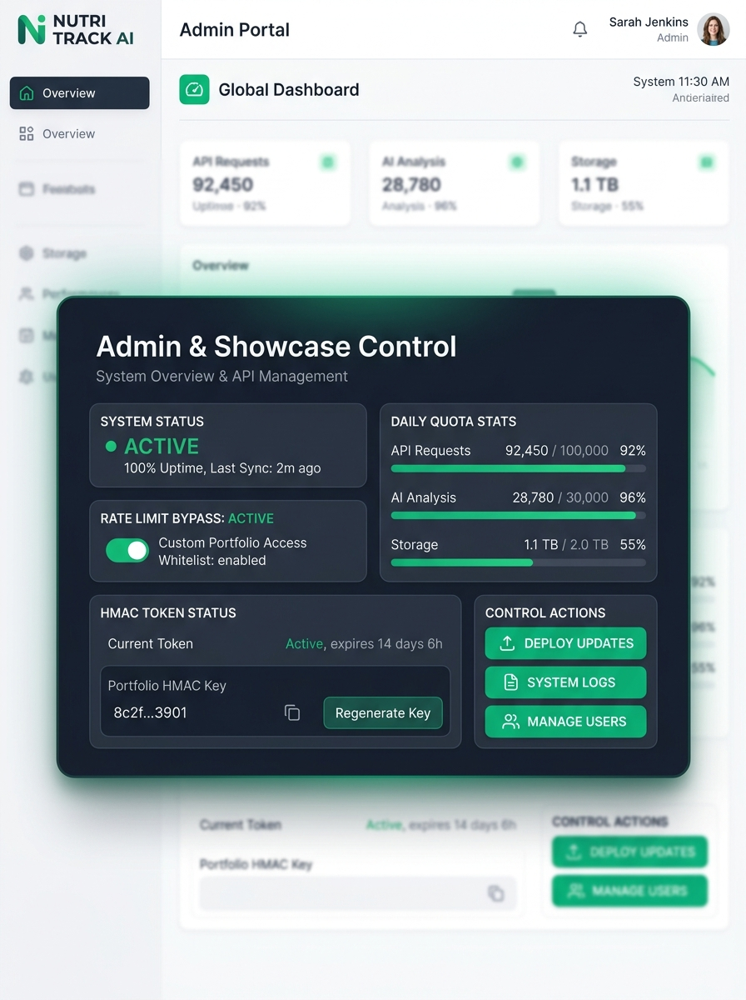
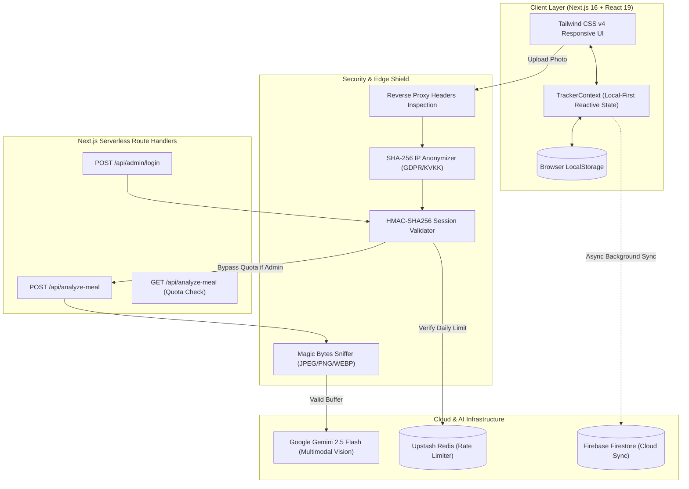
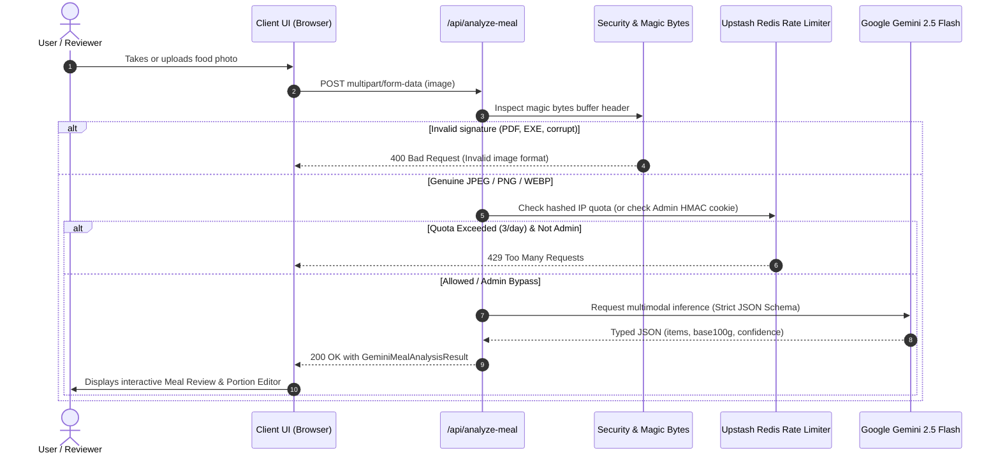
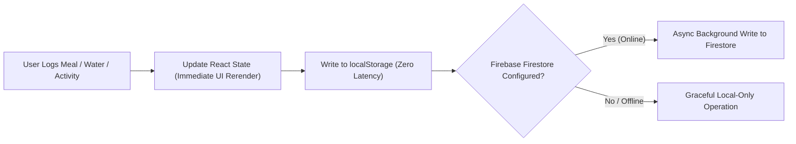
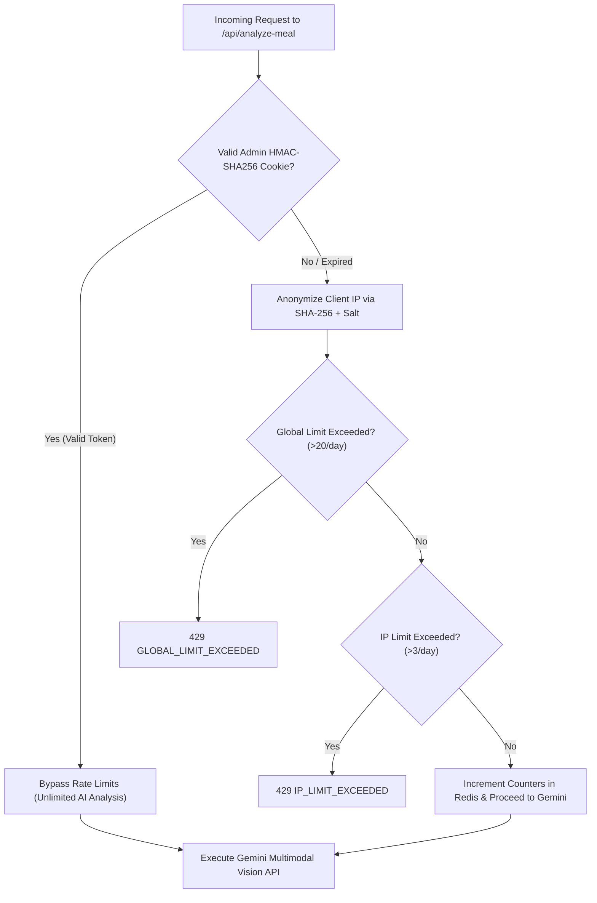

<div align="center">

# 🥑 NutriTrack AI

### Next-Gen Multimodal AI Nutrition & Activity Tracking System

[](https://nextjs.org/)
[](https://react.dev/)
[](https://www.typescriptlang.org/)
[](https://tailwindcss.com/)
[](https://ai.google.dev/)
[](https://firebase.google.com/)
[](https://upstash.com/)
[-6E9F18?style=for-the-badge&logo=vitest)](https://vitest.dev/)
[](LICENSE)

<p align="center">
  A production-ready, full-stack Health-Tech web application combining <b>Google Gemini 2.5 Multimodal Vision AI</b>, <b>Local-First dual persistence</b>, <b>proportional 100g nutrition scaling mathematics</b>, <b>daily energy balance tracking</b>, and an <b>enterprise-grade security shield</b> with IP anonymization, magic-byte binary validation, and an HMAC-signed Admin Showcase mode.
</p>

[**Key Features**](#-core-features) •
[**Live Screenshots**](#-screenshots-showcase) •
[**System Architecture**](#-system-architecture) •
[**Tech Stack**](#-tech-stack) •
[**Quickstart**](#-local-setup--quickstart) •
[**Security Model**](#-security-privacy--gdpr-compliance)

</div>

---

## 🌟 Overview

NutriTrack AI solves the primary bottleneck in digital health tracking: **friction in nutritional logging**. Traditional apps force users to search massive, uncurated databases and manually guess serving sizes. NutriTrack AI turns meal analysis into a **single photo snap**:

1. **Instant Multimodal AI Recognition**: Upload or capture a plate of food. Google Gemini 2.5 Flash detects food items, estimates portion gram weights, and outputs structured JSON adhering to a strict nutritional schema.
2. **Proportional 100g Base Nutrition Mathematics**: Recalculate calories and macronutrients (protein, carbs, fat) dynamically when portion weight is adjusted, preventing rounding drift and floating-point errors.
3. **Dynamic Energy Balance**: Tracks Net Calories ($\text{Consumed} - \text{Burned}$) against dynamic user goals with an interactive circular SVG progress ring and step-burn coefficients.
4. **Local-First Dual-Persistence**: Zero-latency UI response powered by local storage hydration with background asynchronous synchronization to Firebase Firestore.
5. **Production Security Shield**: Dual-tier rate limiting (Upstash Redis) with GDPR/KVKK-compliant salted SHA-256 IP hashing, magic-byte binary buffer sniffing, and an HMAC-SHA256 Admin Showcase bypass.

---

## 📸 Screenshots Showcase

<table align="center" width="100%">
  <tr>
    <td width="33%" align="center">
      <br />
      <b>01. Energy Balance & Today Dashboard</b><br />
      <sub>Dynamic circular SVG calorie ring, net balance, macro targets, and meal feed</sub>
    </td>
    <td width="33%" align="center">
      <br />
      <b>02. Gemini Multimodal Vision AI</b><br />
      <sub>Instant camera capture, image upload, and structured JSON parsing</sub>
    </td>
    <td width="33%" align="center">
      <br />
      <b>03. 100g Base Meal Review & Edit</b><br />
      <sub>Proportional macro recalculation, gram adjustments, and confidence badges</sub>
    </td>
  </tr>
  <tr>
    <td width="33%" align="center">
      <br />
      <b>04. Steps, Hydration & MET Activity</b><br />
      <sub>Live step counters, +250ml/+500ml quick water logs, and MET calorie burn</sub>
    </td>
    <td width="33%" align="center">
      <br />
      <b>05. Weekly Trends & Recharts Analytics</b><br />
      <sub>7-day caloric balance charts, average intake vs. burn, and goal trend lines</sub>
    </td>
    <td width="33%" align="center">
      <br />
      <b>06. Admin & Showcase Mode</b><br />
      <sub>HMAC-SHA256 authenticated control panel with rate-limit bypass for reviewers</sub>
    </td>
  </tr>
</table>

---

## 🚀 Core Features

### 1. Multimodal AI Meal Analysis (Google Gemini 2.5 Flash)
- **Computer Vision Pipeline**: Analyzes raw image buffers directly via the `@google/genai` SDK.
- **Strict JSON Schema Enforcement**: Guarantees typed meal descriptions, overall confidence scores ($0.0 - 1.0$), and itemized food items with standard 100g base macro references.
- **Graceful Error Fallbacks**: Automated fallback fixtures ensure the UI remains functional even during simulated network outages or missing API credentials.

### 2. Proportional 100g Base Nutrient Mathematics
- Every detected food item retains immutable 100g baseline macros:
  $$\text{Factor} = \frac{\text{Weight (g)}}{100}$$
  $$\text{Calories} = \text{round}(\text{BaseCalories} \times \text{Factor})$$
  $$\text{Nutrient (g)} = \frac{\text{round}(\text{BaseNutrient} \times \text{Factor} \times 10)}{10}$$
- Changing gram weight from $150\text{g} \to 200\text{g}$ or $100\text{g} \to 50\text{g}$ scales all macros synchronously with single-decimal precision and zero floating-point drift.

### 3. Real-Time Energy Balance Engine
- Comprehensive daily energy balance:
  $$\text{Consumed} = \sum \text{Meal Calories}$$
  $$\text{Burned} = \sum \text{Exercise Calories} + \text{round}(\text{Steps} \times 0.04)$$
  $$\text{Net Calories} = \text{Consumed} - \text{Burned}$$
  $$\text{Remaining Calories} = \max(0, \text{Daily Goal} - \text{Net Calories})$$
- Interactive SVG circular ring visually adapts with emerald, warning, and alert themes based on progress.

### 4. Hydration & Activity Tracking
- **Quick Water Actions**: One-click $+250\text{ ml}$ and $+500\text{ ml}$ increment buttons with instant tactile feedback and progress bars.
- **MET Activity Logger**: Built-in MET database (Running, Walking, Cycling, Swimming, HIIT, Strength) calculating calories burned based on exercise duration and intensity.

### 5. Weekly Analytics (Recharts Visualization)
- Responsive charts for 7-day caloric deficit/surplus trends, step consistency, and daily water volume.
- Computes weekly rolling averages and visualizes goal benchmark lines.

### 6. Local-First & Dual-Persistence Architecture
- **Instant UI Response**: Reads and writes to `localStorage` immediately (optimistic UI).
- **Background Cloud Synchronization**: Asynchronously pushes daily logs, meals, and activities to **Firebase Firestore**.
- **Zero-Config Offline Mode**: Fully operational even when Firebase credentials are omitted or internet connectivity drops.

### 7. Dual-Tier Rate Limiting (Upstash Redis)
- **IP Quota Guard**: Strict 3 AI analyses per IP per day (`AI_DAILY_LIMIT=3`).
- **Global Circuit Breaker**: Maximum 20 AI analyses system-wide per day (`GLOBAL_AI_DAILY_LIMIT=20`).
- **In-Memory Graceful Fallback**: Automatically switches to an in-memory sliding window cache if Redis is unreachable.

### 8. Admin & Portfolio Showcase Mode
- **Zero-Friction Reviewing**: Dedicated `/admin` route allows interviewers and portfolio reviewers to log in and bypass rate limits.
- **Timing-Safe Credentials**: Uses Node.js `crypto.timingSafeEqual` to prevent timing side-channel attacks.
- **HMAC-SHA256 Signed Session**: Secure `HttpOnly`, `SameSite=Strict`, `Secure` cookie with a 7-day TTL and anti-tamper signature verification.

---

## 🏗️ System Architecture

### High-Level System Topology



---

### Multimodal Gemini AI Vision Flow



---

### Local-First Dual-Persistence Flow



---

### Rate Limiting & Admin Bypass Decision Matrix



---

## 🛠️ Tech Stack

| Category | Technology | Version | Purpose |
|---|---|---|---|
| **Framework** | [Next.js](https://nextjs.org/) | `16.3.4` | App Router, Serverless Route Handlers, Turbopack engine |
| **Frontend Library** | [React](https://react.dev/) | `19.2.8` | Server and Client components, Hooks, Actions |
| **Language** | [TypeScript](https://www.typescriptlang.org/) | `5.x` | Strict type safety across all domain models, schemas, and API payloads |
| **Styling** | [Tailwind CSS](https://tailwindcss.com/) | `v4.x` | Modern CSS tokens, fluid typography, dark-surface glassmorphism |
| **AI Vision** | [Google Gen AI SDK](https://ai.google.dev/) | `^2.21.0` | Gemini 2.5 Flash multimodal image recognition & structured JSON schemas |
| **Cloud Database** | [Firebase Firestore](https://firebase.google.com/) | `^12.19.0` | Local-First cloud synchronization for meals, logs, and activities |
| **Rate Limiting** | [Upstash Redis](https://upstash.com/) | `^1.38.4` | Distributed daily quota counters with in-memory fallback |
| **Data Visualization** | [Recharts](https://recharts.org/) | `^3.10.1` | Responsive 7-day calorie balance, step, and hydration charts |
| **Testing** | [Vitest](https://vitest.dev/) | `^5.0.0` | 58 unit and functional verification tests (100% pass) |
| **Icons** | [Lucide React](https://lucide.dev/) | `^1.44.0` | Accessible, consistent health-tech iconography |

---

## 💻 Local Setup & Quickstart

### Prerequisites
- **Node.js**: `v20.x` or later (tested on Node `v24.x`)
- **npm**: `v10.x` or later

### Step 1: Clone the Repository
```bash
git clone https://github.com/Ramboyk/ai-calorie-activity-tracker.git
cd ai-calorie-activity-tracker
```

### Step 2: Install Dependencies
```bash
npm install --legacy-peer-deps
```

### Step 3: Configure Environment Variables
Copy `.env.example` to create your `.env.local`:
```bash
cp .env.example .env.local
```
*(See the [Environment Variables](#-environment-variables) section below for optional keys. The app runs fully in Local-First mode even with empty keys!)*

### Step 4: Run the Development Server
```bash
npm run dev
```
Open [http://localhost:3000](http://localhost:3000) in your browser.

### Step 5: Run Automated Tests
```bash
npm test
```
All 58 tests across 5 test suites will run in ~400ms.

---

## 🔐 Environment Variables

| Variable | Required? | Default / Fallback | Description |
|---|---|---|---|
| `GEMINI_API_KEY` | Recommended | Fallback Mock Analysis | Google Gemini API key for real-time meal image analysis |
| `UPSTASH_REDIS_REST_URL` | Optional | In-Memory Store | Upstash Redis REST endpoint for distributed rate limiting |
| `UPSTASH_REDIS_REST_TOKEN` | Optional | In-Memory Store | Upstash Redis REST access token |
| `AI_DAILY_LIMIT` | Optional | `3` | Maximum AI analyses allowed per IP per 24-hour window |
| `GLOBAL_AI_DAILY_LIMIT` | Optional | `20` | System-wide maximum daily AI analyses limit |
| `IP_HASH_SALT` | Optional | Built-in Salt | Secret salt string used for SHA-256 client IP anonymization |
| `ADMIN_USERNAME` | Optional | `admin` | Username for the Admin Showcase mode |
| `ADMIN_PASSWORD` | Optional | `admin123` | Password for the Admin Showcase mode |
| `ADMIN_SESSION_SECRET` | Optional | Built-in Secret | Secret key used for signing HMAC-SHA256 session cookies |
| `NEXT_PUBLIC_FIREBASE_API_KEY` | Optional | Local-Only Storage | Firebase Web API Key for cloud persistence |
| `NEXT_PUBLIC_FIREBASE_PROJECT_ID` | Optional | Local-Only Storage | Firebase Project ID |

---

## 🛡️ Security, Privacy & GDPR Compliance

1. **KVKK / GDPR Client IP Anonymization**:
   - Raw client IP addresses are **never stored or written to disk**.
   - Client IPs are immediately passed through `crypto.createHash("sha256").update(ip + salt).digest("hex").slice(0, 32)` before Redis quota evaluation.
2. **Magic Bytes Binary Inspection**:
   - Rather than trusting spoofable MIME-types or file extensions, file buffers are inspected byte-by-byte:
     - **JPEG**: `0xFF 0xD8 0xFF`
     - **PNG**: `0x89 0x50 0x4E 0x47`
     - **WEBP**: `RIFF` (bytes 0–3) and `WEBP` (bytes 8–11)
   - Disguised executables (`MZ`), shell scripts (`#!/bin`), or PDFs (`%PDF`) are rejected before touching the AI model.
3. **Timing-Attack Resistant Authentication**:
   - Admin credential validation utilizes `crypto.timingSafeEqual` to eliminate timing side-channel leaks.
4. **Hardened HTTP Security Headers**:
   - `Content-Security-Policy`, `X-Frame-Options: DENY`, `X-Content-Type-Options: nosniff`, `Referrer-Policy: strict-origin-when-cross-origin`, and `Permissions-Policy`.

---

## 🧪 Automated Test Suites

The project features a **100% green (58/58 passing)** test suite built with **Vitest**:

```text
 RUN  v5.0.0 C:/Users/HP/Documents/AI Calorie & Activity Tracker

 ✓ src/__tests__/nutrition-math.test.ts (9 tests)
 ✓ src/__tests__/file-validation.test.ts (11 tests)
 ✓ src/__tests__/auth-session.test.ts (13 tests)
 ✓ src/__tests__/energy-balance.test.ts (17 tests)
 ✓ src/__tests__/rate-limit.test.ts (8 tests)

 Test Files  5 passed (5)
      Tests  58 passed (58)
   Duration  ~400ms
```

- [`energy-balance.test.ts`](file:///c:/Users/HP/Documents/AI%20Calorie%20&%20Activity%20Tracker/src/__tests__/energy-balance.test.ts): Formulas for burned calories, steps ($\times 0.04$), net balance, remaining calories clamp, and edge guards.
- [`nutrition-math.test.ts`](file:///c:/Users/HP/Documents/AI%20Calorie%20&%20Activity%20Tracker/src/__tests__/nutrition-math.test.ts): Proportional scaling ($100\text{g} \to 50\text{g}$, $150\text{g} \to 200\text{g}$), decimal rounding, $0\text{g}$ guards, and caps.
- [`rate-limit.test.ts`](file:///c:/Users/HP/Documents/AI%20Calorie%20&%20Activity%20Tracker/src/__tests__/rate-limit.test.ts): Deterministic SHA-256 IP anonymization, collision resistance, and irreversibility.
- [`file-validation.test.ts`](file:///c:/Users/HP/Documents/AI%20Calorie%20&%20Activity%20Tracker/src/__tests__/file-validation.test.ts): Verification of genuine JPEG/PNG/WEBP buffers and rejection of malicious payloads.
- [`auth-session.test.ts`](file:///c:/Users/HP/Documents/AI%20Calorie%20&%20Activity%20Tracker/src/__tests__/auth-session.test.ts): HMAC session issuance, anti-tampering verification, expiration, and timing-safe logins.

---

## ⚠️ Health & Medical Disclaimer

> [!WARNING]
> **NutriTrack AI is an educational demonstration and personal lifestyle tracking tool.** It is not a medical device, nor does it provide professional medical, dietary, or diagnostic advice. Calorie and macronutrient estimates generated by the Google Gemini AI vision pipeline are algorithmic approximations. Users should always consult with a qualified physician or registered dietitian before making significant changes to their diet or exercise regimen.

---

## 🗺️ Roadmap

- [ ] **Barcode Scanner Integration**: Instant lookup of packaged foods via Open Food Facts API.
- [ ] **Wearable Health Sync**: Bidirectional sync with Apple HealthKit and Google Health Connect.
- [ ] **Progressive Web App (PWA)**: Full offline service worker caching and installable mobile home screen icon.
- [ ] **Dark / Light Theme Toggle**: Adaptive UI matching system-level color schemes.

---

## 📄 License

Distributed under the **MIT License**. See [`LICENSE`](LICENSE) for more information.

```text
Copyright (c) 2026 Ramazan Yıldırımkaraman (Ramboyk)
```

---

<div align="center">
  <sub>Crafted with ❤️ by <a href="https://github.com/Ramboyk">Ramazan Yıldırımkaraman</a> • NutriTrack AI © 2026</sub>
</div>
